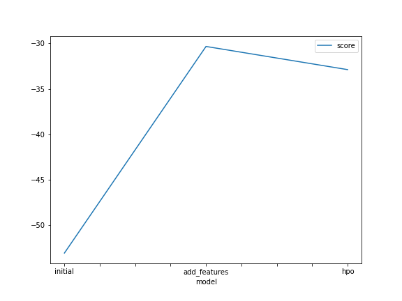
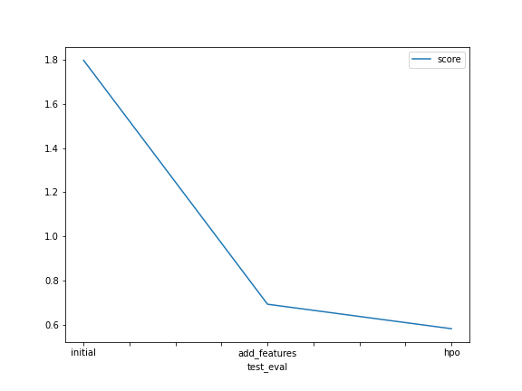

# Report: Predict Bike Sharing Demand with AutoGluon Solution
#### NAME HERE

## Initial Training
### What did you realize when you tried to submit your predictions? What changes were needed to the output of the predictor to submit your results?
I realized that submitting prediction values that are below zero caused an error from the kaggle side. Therefore, I had to change every negative prediction to zero.

### What was the top ranked model that performed?
WeightedEnsemble_L3 was the top ranked model. 

## Exploratory data analysis and feature creation
### What did the exploratory analysis find and how did you add additional features?
The features season and weather were being seen as just numbers, which they are not. So changing their data type to categorical made sure the model sees them as categories. In addition, spliting the datetime into month, day and hour made our model create relations that wouldn't have before.

### How much better did your model preform after adding additional features and why do you think that is?
The score of the model went from 1.79019 to 0.69187. 

## Hyper parameter tuning
### How much better did your model preform after trying different hyper parameters?
Unfortunately, the model got worse after adding few parameters. The score fell to 0.73963.

### If you were given more time with this dataset, where do you think you would spend more time?
Next steps will be to further fine tuning the model to get the score below the 0.5 score.

### Create a table with the models you ran, the hyperparameters modified, and the kaggle score.
|    model	        |hpo1	                                   |hpo2	    |hpo3	    |score  |
|-------------------|------------------------------------------|------------|-----------|-------|
| 	initial	        |default	                               |default	    |default	|1.79019|
| 	add_features	|default	                               |default	    |default	|0.69187|
| 	hpo	            |{'CAT': {'depth': ag.space.Int(7,8)}}	   |default	    |default	|0.73963|

### Create a line plot showing the top model score for the three (or more) training runs during the project.

### Create a line plot showing the top kaggle score for the three (or more) prediction submissions during the project.

## Summary
I need to spend more time tuning hyperparameters to achieve a better result. From other submission, I can see the score can go as low as 0.3. Therefore, the experimenting with different algorithms and hyperparameters is required to make the model better than it is now.
